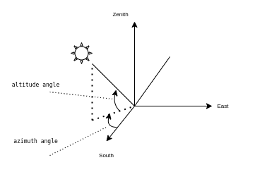

# Solar-monitoring
## Sun Position Calculator 
- Input : latitude , longitude
- Output : altitude angle , azimuth angle

**Description** : Server receive latitude , longitude from Client and base on Server datetime to calculate altitude angle , azimuth angle **radian**

<p align="center">
  
</p>

**API** 
```
curl --location --request GET 'localhost:3000' \
--header 'Content-Type: application/json' \
--data-raw '{
    "lat" : 10.816572,
    "lng":106.674488
}'
```
Respond
```
{"azimuth":2.993996513805611,"altitude":-1.1569317866783029}
```
***Note*** : It's radian unit
